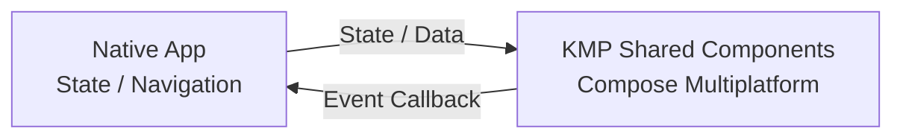
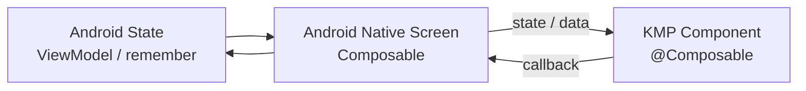
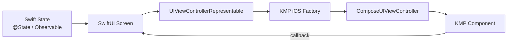
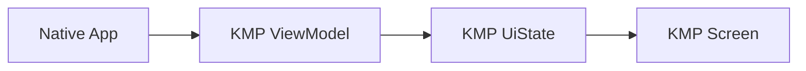
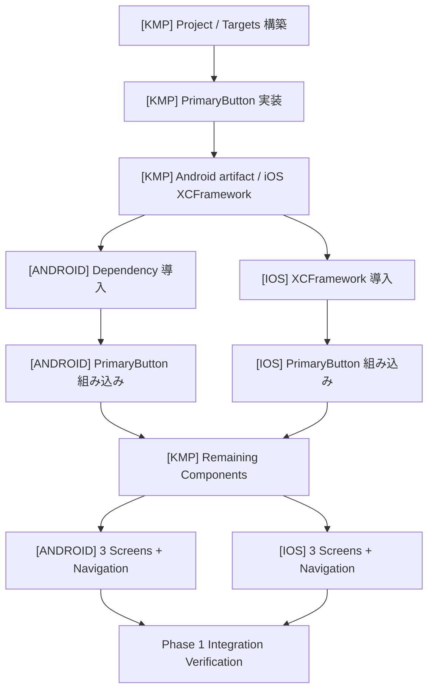

# Kotlin Multiplatform (KMP) Shared Component 検証計画書

## 0. 目的

本プロジェクトは、Kotlin Multiplatform + Compose Multiplatform で実装した UI Component を、以下のネイティブアプリへ組み込む方式を検証するための Sample Project である。

- Android: Kotlin + Jetpack Compose
- iOS: Swift + SwiftUI
- Shared UI: Kotlin Multiplatform + Compose Multiplatform

以下の3リポジトリを独立して用意する。

```text
kmp-shared-components
android-sample-app
ios-sample-app
```

最終目的は、単に「KMP UI が表示できる」ことではなく、以下を段階的に確認することにある。

1. KMP Component を独立ライブラリとして配布できる
2. Android / iOS の既存ネイティブ画面へ部分的に組み込める
3. Native State / Native Navigation と KMP UI を安全に接続できる
4. KMP に持たせる責務を段階的に増やした場合の境界を把握できる
5. 実サービスへ適用する場合の現実的な構成を判断できる

---

# 1. 全体方針

Phase 1 では、KMP を **State Owner にしない UI Component Library** として扱う。



Phase 1 の基本原則は以下。

- Navigation の所有者は Native
- Screen State の所有者は Native
- KMP は渡された State を描画する
- KMP で発生した操作は callback として Native へ返す
- KMP Component 自体は外部状態に対する副作用を持たない
- Android / iOS の Integration API を Component 実装とは分離する

> **重要:** Stateless とは「Compose の `remember` を一切使わない」という意味ではない。
>
> Component の外部仕様として、業務状態・画面状態を Component 自身が所有しないことを意味する。
> 描画やアニメーション実現のための内部的・一時的な Compose State は必要に応じて使用してよい。
>
> ただし Phase 1 では、`expanded` / `loading` / `selectedTab` など外から意味を持つ State は必ず Native 側から渡す。

---

# 2. Phase 1 の完了条件

Phase 1 は以下をすべて満たした時点で完了とする。

- [ ] `kmp-shared-components` 単体で Android / iOS 向け成果物を生成できる
- [ ] Android Sample から KMP Component を利用できる
- [ ] iOS Sample から KMP Component を利用できる
- [ ] Native → KMP へ State / Data を渡せる
- [ ] KMP → Native へ callback を返せる
- [ ] Native Navigation と KMP UI が共存できる
- [ ] Android / iOS で Home / Dashboard / Detail の3画面を操作できる
- [ ] 100件以上のリストをスクロールできる
- [ ] Expand / Loading 系アニメーションが Android / iOS で動作する
- [ ] iOS の SwiftUI NavigationStack / TabView を KMP が所有しない
- [ ] Android の Navigation Compose を KMP が所有しない
- [ ] 各 Component の State Owner が明確になっている
- [ ] Component 単位で Native App へ部分導入できることを確認できる

---

# 3. Repository 構成

## 3.1 `kmp-shared-components`

役割:

- Compose Multiplatform UI Component の実装
- Component 用 Model の定義
- Android 向け公開 API
- iOS 向け公開 API / `UIViewController` factory
- Android / iOS 向け artifact の生成

推奨構成:

```text
kmp-shared-components/
├── shared/
│   └── src/
│       ├── commonMain/
│       │   └── kotlin/
│       │       ├── component/
│       │       ├── model/
│       │       └── theme/
│       ├── androidMain/
│       │   └── kotlin/
│       │       └── integration/
│       └── iosMain/
│           └── kotlin/
│               └── integration/
├── gradle/
├── build.gradle.kts
├── settings.gradle.kts
└── README.md
```

### `commonMain`

基本的な Component 実装を置く。

```text
component/
├── PrimaryButton.kt
├── ItemCard.kt
├── ScrollableCardList.kt
├── AnimatedExpandableCard.kt
├── PulseLoadingButton.kt
├── AppTopAppBar.kt
└── AppNavigationBar.kt
```

### `iosMain`

Swift から `@Composable` を直接呼ばせない。

Swift / SwiftUI から呼び出せる `UIViewController` factory を用意する。

イメージ:

```kotlin
fun PrimaryButtonViewController(
    title: String,
    onClick: () -> Unit,
): UIViewController = ComposeUIViewController {
    PrimaryButton(
        title = title,
        onClick = onClick,
    )
}
```

必要に応じて Component ごとではなく汎用的な Host API にまとめてもよいが、Phase 1 では **Component と Native の境界を理解しやすい factory 方式を優先する。**

---

## 3.2 `android-sample-app`

役割:

- Android Native Navigation
- Android 側 State 管理
- KMP Component のホスト
- Android 上での表示・イベント・Performance 検証

技術構成:

```text
Kotlin
Jetpack Compose
Navigation Compose
```

---

## 3.3 `ios-sample-app`

役割:

- SwiftUI Navigation
- Swift 側 State 管理
- KMP Component のホスト
- iOS 上での表示・イベント・Performance 検証

技術構成:

```text
Swift
SwiftUI
NavigationStack
TabView
UIViewControllerRepresentable
```

SwiftUI 側では KMP が公開する `UIViewController` を `UIViewControllerRepresentable` でラップする。

---

# 4. Phase 1 Architecture

## 4.1 Android

Android は Kotlin / Compose 同士のため、KMP の `@Composable` Component を基本的に直接呼び出す。



---

## 4.2 iOS

Swift から Kotlin の `@Composable` を直接利用する構成にはしない。



この境界を明示することが Phase 1 で最も重要な検証項目の1つとなる。

---

# 5. Phase 1 Component 一覧

## 5.1 静的 UI Component

| Component | 主な Compose API | State Owner | 検証目的 |
|---|---|---|---|
| `PrimaryButton` | `Button`, `Text` | Native | 最小単位で Native → KMP → Native のイベント往復を確認 |
| `ItemCard` | `Card`, `Row`, `Text`, Icon | Native | Native から渡されたデータの表示 |

### `PrimaryButton`

推奨 Interface:

```kotlin
@Composable
fun PrimaryButton(
    title: String,
    enabled: Boolean = true,
    onClick: () -> Unit,
)
```

Phase 1 の最初に必ず実装する。

この Component だけで以下を確認する。

```text
Android App
    ↓
KMP PrimaryButton
    ↓ callback
Android Navigation / State

iOS App
    ↓
ComposeUIViewController
    ↓
KMP PrimaryButton
    ↓ callback
Swift Navigation / State
```

これが成功するまでは他 Component を増やさない。

---

### `ItemCard`

Phase 1 では画像リソースの Platform 間受け渡しを主要テーマにしない。

Native の `UIImage` / Android `Drawable` 等を直接 KMP API に渡すと、UI Component 検証とは別の Interop 課題が増えるためである。

したがって最初は以下のいずれかを利用する。

- Compose Multiplatform Resource
- KMP 内部 Vector Icon
- 単純な placeholder

推奨 Model:

```kotlin
data class ItemCardModel(
    val id: String,
    val title: String,
    val description: String,
)
```

---

# 5.2 Scroll Component

## `ScrollableCardList`

主な要素:

```text
LazyColumn
items
ItemCard
```

Interface 例:

```kotlin
@Composable
fun ScrollableCardList(
    items: List<ItemCardModel>,
    onItemClick: (String) -> Unit,
)
```

### 検証内容

- 100件
- 1,000件

の2パターンを推奨する。

確認項目:

- Android スクロール
- iOS スクロール
- Fling / 慣性
- Item click
- 再描画
- Native Screen 内へ部分的に配置した際のスクロール競合

Phase 1 では厳密な Benchmark 数値を必須にせず、明確な jank / input latency がないかを中心に確認する。

---

# 5.3 Animation Component

## `AnimatedExpandableCard`

Native が `expanded` State を所有する。

```kotlin
@Composable
fun AnimatedExpandableCard(
    title: String,
    description: String,
    expanded: Boolean,
    onExpandedChange: (Boolean) -> Unit,
)
```

KMP:

```text
描画
AnimatedVisibility
animateContentSize
```

Native:

```text
expanded State の保持
```

と役割を分離する。

---

## `PulseLoadingButton`

`loading` は Native が所有する。

```kotlin
@Composable
fun PulseLoadingButton(
    title: String,
    loading: Boolean,
    onClick: () -> Unit,
)
```

KMP 内部では `loading == true` の間のみ `rememberInfiniteTransition` 等を使用してよい。

検証:

- Scale
- Alpha
- Loading ON/OFF
- Component dispose 後に Animation が継続しないこと

---

# 5.4 Layout Component

## `AppTopAppBar`

```kotlin
@Composable
fun AppTopAppBar(
    title: String,
    showBackButton: Boolean,
    onBackClick: () -> Unit,
)
```

KMP は BackStack を知らない。

```text
KMP
onBackClick()

↓

Native
navController.popBackStack()
NavigationStack dismiss/pop
```

---

## `AppNavigationBar`

Native が現在の Tab を所有する。

```kotlin
@Composable
fun AppNavigationBar(
    selectedTab: AppTab,
    onTabSelected: (AppTab) -> Unit,
)
```

KMP は Navigation を実行しない。

---

# 6. Native App 画面構成

```text
Root
├── Main Tabs
│   ├── Home
│   └── Dashboard
└── Detail
```

Native Navigation のみを使用する。

---

# 6.1 HomeScreen

## Native の責務

- Root Layout
- Current Tab
- Expanded State
- Loading State
- Navigation
- Callback 処理

## KMP Component

```text
AppTopAppBar
AnimatedExpandableCard
PulseLoadingButton
PrimaryButton
AppNavigationBar
```

## 推奨 State

Android:

```kotlin
var expanded by remember { mutableStateOf(false) }
var loading by remember { mutableStateOf(false) }
```

iOS:

```swift
@State private var expanded = false
@State private var loading = false
```

## 検証

- KMP callback → Native State 更新
- KMP button → Native Navigation
- Animation 中の Navigation
- Navigation 後の Component dispose
- 戻った後の State の扱い

---

# 6.2 DashboardScreen

## Native の責務

- Dummy Data 作成
- List Data の保持
- Item click handling
- Navigation

## KMP Component

```text
AppTopAppBar
ScrollableCardList
AppNavigationBar
```

## Dummy Data

最低:

```text
100 items
```

追加検証:

```text
1,000 items
```

を推奨する。

---

# 6.3 DetailScreen

## Native の責務

- Push / Pop
- Back stack
- Detail Data
- Native gesture

## KMP Component

```text
AppTopAppBar
ItemCard
PrimaryButton
```

## 検証

Android:

```text
System Back
TopAppBar Back
PrimaryButton Back
```

iOS:

```text
NavigationStack Back
Swipe Back
TopAppBar Back
PrimaryButton Back
```

すべて Native Navigation を利用する。

---

# 7. Artifact / Dependency Integration 方針

3 Repository が独立しているため、Library の「生成」と「Native App への導入」を Phase 1 の正式な検証対象とする。

ただし最初から GitHub Packages 等の Remote Distribution までは実施しない。

---

## 7.1 Android

Phase 1 は以下の順序で進める。

### Step A

KMP Repository 内で Android artifact を生成。

### Step B

Local Maven Repository へ publish。

例:

```text
group = sample.kmp
artifact = shared-components
version = 0.1.0
```

Android Sample 側:

```kotlin
implementation("sample.kmp:shared-components:0.1.0")
```

### 理由

単純な AAR の手動 copy よりも、

```text
Library Version
Dependency
再ビルド
更新
```

の流れを再現しやすい。

Remote Maven / GitHub Packages への publish は Phase 1 完了後でもよい。

---

# 7.2 iOS

Phase 1 では XCFramework を生成し、iOS Sample へ組み込む。

候補:

1. XCFramework のローカル組み込み
2. CocoaPods
3. Direct Integration
4. 将来的に Swift Package Manager 向け distribution

3 Repository が独立した Sample であるため、Phase 1 では **XCFramework を artifact として生成し、iOS Sample がそれを取り込む方法を最優先**とする。

まず Distribution を高度化するのではなく、

```text
KMP build
↓
XCFramework
↓
Xcode project
↓
SwiftUI
```

を成立させる。

---

# 8. Phase 1 実装手順

ここが Phase 1 の実作業順序である。

---

## Phase 1-A: KMP 最小構成

### Goal

KMP Library が Android / iOS の両 target で build できる状態にする。

### Tasks

- [ ] `kmp-shared-components` 作成
- [ ] Kotlin Multiplatform 設定
- [ ] Compose Multiplatform 設定
- [ ] Android Target 設定
- [ ] iOS Targets 設定
- [ ] `commonMain` / `androidMain` / `iosMain` 確認
- [ ] Compose Theme の最小構成
- [ ] Android artifact build
- [ ] iOS Framework / XCFramework build

### Done

```text
Android artifact が生成可能
AND
iOS artifact が生成可能
```

---

# Phase 1-B: PrimaryButton Vertical Slice

## Goal

**1 Component だけで3 Repository 間の Integration を完成させる。**

これが Phase 1 の最重要ステップ。

### KMP

- [ ] `PrimaryButton` 作成
- [ ] `title`
- [ ] `enabled`
- [ ] `onClick`
- [ ] Android から利用可能
- [ ] iOS 向け `PrimaryButtonViewController()` factory 作成

### Android

- [ ] Dependency 追加
- [ ] `PrimaryButton` 表示
- [ ] onClick callback 確認

### iOS

- [ ] XCFramework 組み込み
- [ ] `UIViewControllerRepresentable` 作成
- [ ] KMP `PrimaryButtonViewController()` 呼び出し
- [ ] Swift callback 確認

### Done

```text
Android button click
→ Android code

SwiftUI
→ KMP button
→ Swift callback
```

が両方成功すること。

> この段階が完了するまでは、他6 Component を実装しない。

---

# Phase 1-C: Remaining Basic Components

実装順:

```text
1. ItemCard
2. AppTopAppBar
3. AppNavigationBar
```

各 Component ごとに以下を確認する。

- [ ] Android 表示
- [ ] iOS 表示
- [ ] State 入力
- [ ] Callback
- [ ] dispose / recreate

---

# Phase 1-D: Animation

実装順:

```text
1. AnimatedExpandableCard
2. PulseLoadingButton
```

確認:

- [ ] Native State → KMP Animation
- [ ] Animation 中 callback
- [ ] Navigation 後 dispose
- [ ] 再表示
- [ ] iOS 上での滑らかさ
- [ ] Android 上での滑らかさ

---

# Phase 1-E: Scroll

`ScrollableCardList` を実装。

確認:

```text
100 items
1000 items
```

- [ ] scroll
- [ ] fling
- [ ] item click
- [ ] native container との gesture conflict
- [ ] screen recreate

---

# Phase 1-F: Native Navigation

ここで初めて3 Screen を完成させる。

Android:

```text
Navigation Compose
```

iOS:

```text
NavigationStack
TabView
```

KMP に Navigation library は追加しない。

---

# Phase 1-G: Integration Verification

## Android

- [ ] Home → Detail
- [ ] Detail → Back
- [ ] Home ↔ Dashboard
- [ ] System Back
- [ ] Animation
- [ ] Scroll

## iOS

- [ ] Home → Detail
- [ ] Detail → Back
- [ ] Swipe Back
- [ ] Home ↔ Dashboard
- [ ] Animation
- [ ] Scroll

---

# Phase 1-H: Artifact Rebuild Test

最後に Library 更新を Native App が追従できることを確認する。

例:

```text
PrimaryButton padding変更
↓
KMP artifact 0.1.1
↓
Android / iOS 更新
↓
表示変更確認
```

これにより「同一 Repository の shared module」ではなく、

**独立した Shared UI Library として運用可能か**

を確認する。

---

# 9. Phase 1 で意図的にやらないこと

Scope Creep を防ぐため、以下は Phase 1 では実装しない。

```text
KMP ViewModel
StateFlow
Repository
Network
Database
Dependency Injection
KMP Navigation
WebView
Platform Native View
画像の Native Object 受け渡し
Remote Maven Publishing
GitHub Packages
SPM Distribution の完成
Production Architecture
複雑な expect / actual
```

必要になった場合でも Phase 2 以降へ送る。

---

# 10. Phase 1 検証マトリクス

| 項目 | Android | iOS |
|---|---:|---:|
| KMP Component 表示 | ✅ | ✅ |
| Native → KMP State | ✅ | ✅ |
| KMP → Native Callback | ✅ | ✅ |
| Native Navigation | ✅ | ✅ |
| Native Back | ✅ | ✅ |
| Native Tab | ✅ | ✅ |
| Animation | ✅ | ✅ |
| Lazy List | ✅ | ✅ |
| 100件 List | ✅ | ✅ |
| 1,000件 List | Optional | Optional |
| Component Dispose | ✅ | ✅ |
| Artifact Update | ✅ | ✅ |

---

# 11. Phase 1 で記録する検証結果

各 Component ごとに以下を README 等へ記録する。

```markdown
## Component: PrimaryButton

### Android
- Result:
- Issue:
- Notes:

### iOS
- Result:
- Issue:
- Notes:

### Interop
- State:
- Callback:
- Lifecycle:

### Conclusion
- Production 採用可能:
- 条件:
- 懸念:
```

単に「動いた」で終了させず、後から KMP 採用判断に使える情報を残す。

---

# 12. Phase 2 以降

## Phase 2: Native View / Platform Component Interop

対象例:

```text
WebView
AndroidView
UIKitView
```

検証:

- `expect / actual`
- Native View embedding
- URL State
- Progress
- Navigation callback
- Lifecycle

---

# 13. Phase 3: ViewModel / UiState 共通化

KMP 側へ以下を移動する。

```text
UiState
ViewModel
StateFlow
Screen-level Composable
```

構造:



検証:

- StateFlow → Swift
- Lifecycle
- Screen-level common UI
- Native との責務境界

---

# 14. Phase 4: Lifecycle / DI

追加:

```text
Repository interface
DI
viewModelScope
Coroutine
fake asynchronous API
```

検証:

- Native → KMP dependency injection
- ViewModel creation
- ViewModel dispose
- Coroutine cancellation
- Navigation repeat
- Memory leak
- Android Profiler
- Xcode Instruments

---

# 15. Phase 1 の最終的な作業順

迷った場合は必ず以下の順序で進める。

```text
1. KMP Project build
        ↓
2. Android / iOS artifact build
        ↓
3. PrimaryButton
        ↓
4. Android Integration
        ↓
5. iOS Integration
        ↓
6. callback round-trip
        ↓
7. ItemCard
        ↓
8. AppTopAppBar
        ↓
9. AppNavigationBar
        ↓
10. AnimatedExpandableCard
        ↓
11. PulseLoadingButton
        ↓
12. ScrollableCardList
        ↓
13. Home / Dashboard / Detail
        ↓
14. Native Navigation
        ↓
15. Android / iOS integration test
        ↓
16. artifact update test
        ↓
17. Phase 1 完了判定
```

---

# 16. Phase 1 の設計判断まとめ

Phase 1 で最も重要なのは「Component をたくさん作ること」ではない。

確認したい本質は以下。

```text
Native Application
       │
       │ State / Data
       ▼
KMP Shared UI Component
       │
       │ Event
       ▼
Native Application
```

これが、

```text
Android + Jetpack Compose
```

と

```text
iOS + SwiftUI
```

の両方で成立することを確認する。

そのため、

**最初に PrimaryButton だけで3 Repository を End-to-End で貫通させ、その後 Component を増やす。**

これを Phase 1 の基本戦略とする。

---


# 17. Repository 別タスク管理方針

Phase 1 の実装では3 Repository を別々に操作するため、本計画書には全体方針のみを残し、
実際の作業チェックリストは Repository ごとに独立したファイルで管理する。

```text
kmp_shared_component_validation_plan.md
    ├── kmp_shared_components_phase1_tasks.md
    ├── android_sample_app_phase1_tasks.md
    └── ios_sample_app_phase1_tasks.md
```

各タスクファイルでは、すべての項目に Repository を明示する。

| Prefix | Repository |
|---|---|
| `[KMP]` | `kmp-shared-components` |
| `[ANDROID]` | `android-sample-app` |
| `[IOS]` | `ios-sample-app` |

## Phase 1 の Repository 間依存関係



### 重要な進行ルール

1. `[KMP] PrimaryButton` の Android / iOS 向け公開経路が完成するまでは、残り6 Componentを増やさない。
2. Android / iOS は、KMP artifact が必要なタスクを先回りして実装しない。
3. Native側で見つかった問題がKMP公開APIに起因する場合は、KMP Repository側のタスクとして修正する。
4. Navigation / Native State / SwiftUI wrapper / Android Screen は Native Repository側の責務とする。
5. 各RepositoryのREADMEではなく、Phase 1中の実作業は専用タスクファイルを一次情報とする。

---

# 18. Phase 1 の推奨作業順

複数Repositoryを切り替える際は、以下の順序に従う。

```text
[KMP]      Project / Target 構築
[KMP]      PrimaryButton 実装
[KMP]      Android artifact / iOS XCFramework 生成
    ↓
[ANDROID]  PrimaryButton 導入・callback確認
    ↓
[IOS]      PrimaryButton 導入・callback確認
    ↓
[KMP]      ItemCard / AppTopAppBar / AppNavigationBar
    ↓
[ANDROID]  上記3 Component 組み込み確認
[IOS]      上記3 Component 組み込み確認
    ↓
[KMP]      AnimatedExpandableCard / PulseLoadingButton
    ↓
[ANDROID]  Animation確認
[IOS]      Animation確認
    ↓
[KMP]      ScrollableCardList
    ↓
[ANDROID]  Dashboard / Scroll確認
[IOS]      Dashboard / Scroll確認
    ↓
[ANDROID]  Home / Dashboard / Detail + Navigation 完成
[IOS]      Home / Dashboard / Detail + Navigation 完成
    ↓
[KMP]      artifact version 更新
[ANDROID]  更新artifact追従確認
[IOS]      更新artifact追従確認
    ↓
Phase 1 完了判定
```

詳細なチェックリストは以下を参照する。

- `kmp_shared_components_phase1_tasks.md`
- `android_sample_app_phase1_tasks.md`
- `ios_sample_app_phase1_tasks.md`


# 19. 参考資料

- Kotlin Multiplatform: Integration with the SwiftUI framework
- Kotlin Multiplatform: Integration with the UIKit framework
- Kotlin Multiplatform: iOS integration methods
- Kotlin Multiplatform: Create your Kotlin Multiplatform app
- Android Developers: Compose interoperability APIs
